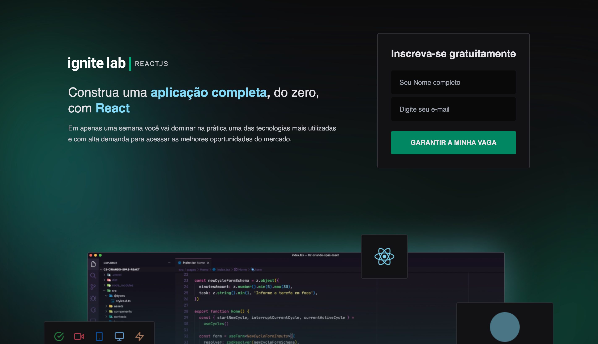
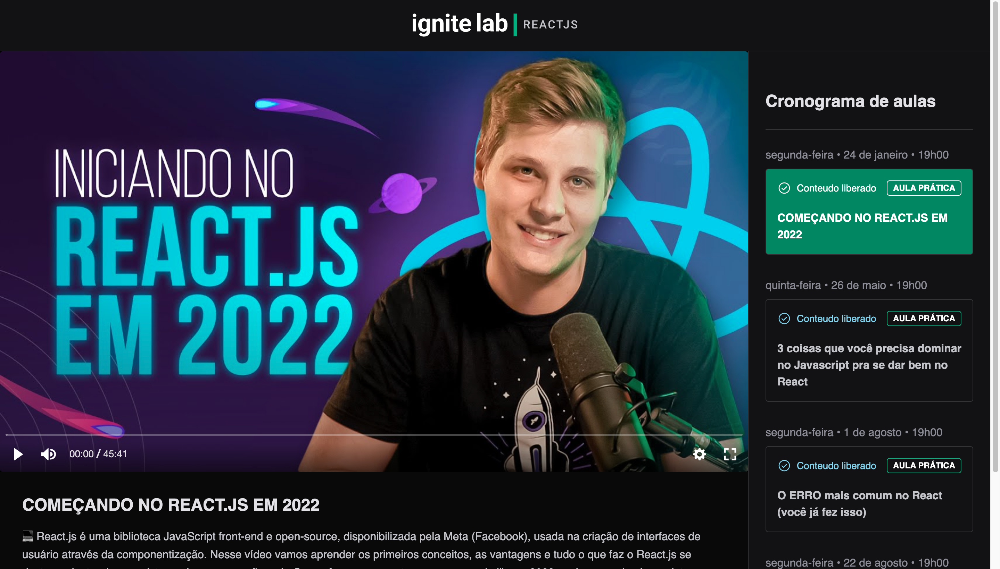
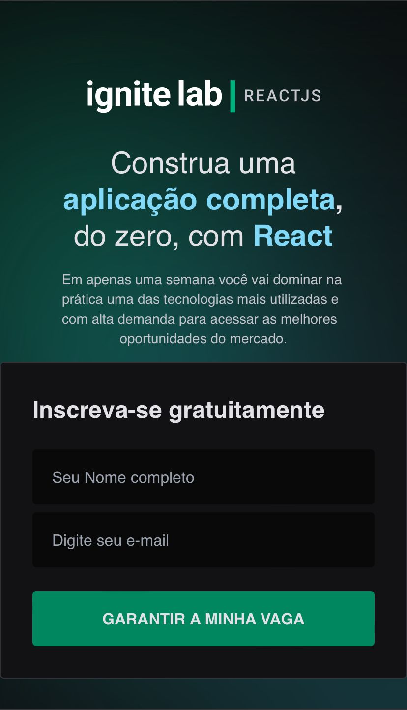
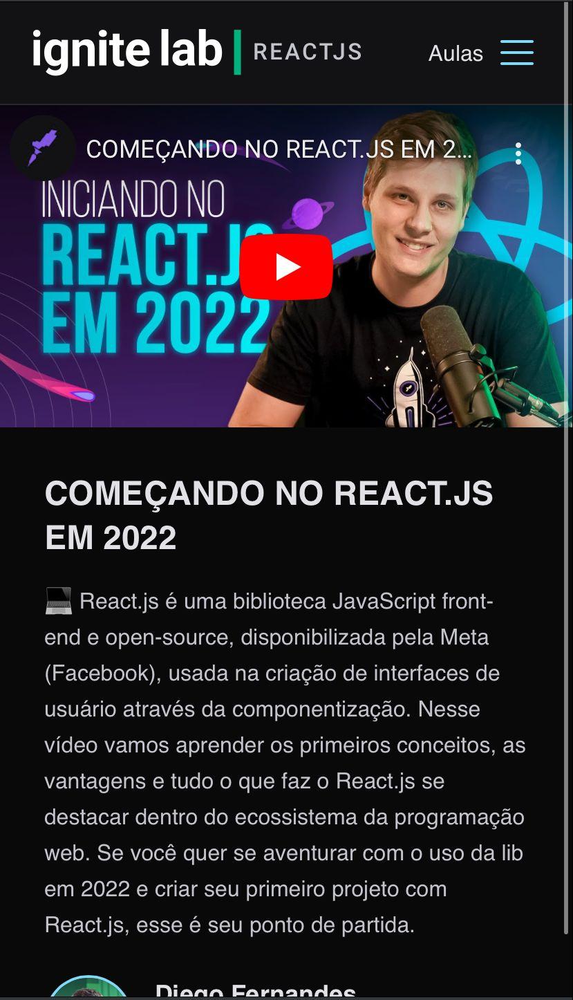

<h1>Plataforma de Aulas Rocketseat</h1>

Assita algumas aulas de React da Rocketseat

<!-- Layout -->

# 🎨 Layout

---

# 🎨 Layout Responsivo

  

  

---

<!-- Linguagens e ferramentas -->

## 🛠 Linguagens e ferramentas

<table>
  <tr>
    <td align="center"><a href="https://reactjs.org/">
      
       
      
        <b>React JS</b>
      
      </a>
    </td>
    <td align="center"><a href="https://www.typescriptlang.org/">
      
       
      
        <b>TypeScript</b>
      
      </a>
    </td>
    <td align="center"><a href="https://tailwindcss.com/">
      
       
      
        <b>Tailwindcss</b>
      
      </a>
    </td>
    <td align="center"><a href="https://git-scm.com/">
      
       
      
        <b>Git</b>
      
      </a>
    </td>
    <td align="center"><a href="https://github.com/">
      
       
      
        <b>GitHub</b>
      
      </a>
    </td>
  </tr>
<table>

## Veja o projeto em produção

<a href="https://event-platform-chi-bay.vercel.app/" >Projeto</a>
